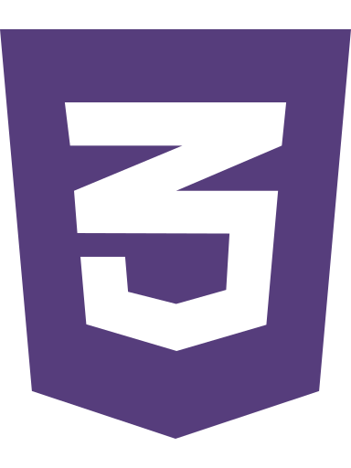

 

## Hi there,

**I'm Caitlyn Boyd, and I'm learning Full-Stack Software Development!**

I'm a self-taught student from Portland, Oregon

 

**Technologies:**

<code></code> <code> <code></code> </code> <code></code>

Over the past year I have spent hundreds of hours becoming familiar with Front-End development.  
I will be beginning Back-End training at the start of March.

 

