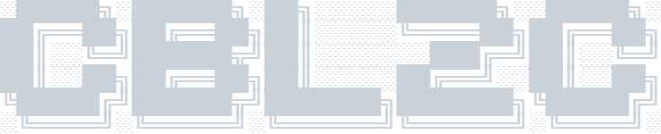

 

 

## Hi there,

**I'm Caitlyn Boyd, and I'm learning Full-Stack Software Development**

I'm a self-taught student from Portland, Oregon

 

**Technologies:**

⠀⠀⠀⠀ ⠀⠀ ⠀⠀ ⠀⠀ 

Over the past year I have spent several thousand hours becoming familiar with Front-End development: HTML/CSS, JS, jQuery, TypeScript, and React.

My first simple React project is **[React Friends](https://cbl2c.github.io/Portfolio_React_Friends)**, which fetches a paginated list of people objects from an API and displays them as bootstrap cards.  React Router and Toast notifications also make an appearance. 

**At this time I have switched from working on an intermediate grounding in Javascript/React to learning the basics of Java, as a program I am quite interested in has made time for me to possibly explore an opportunity working with that language. Expect to see Java notes.** 

No matter what happens, I will begin Back-End development courses with Node, Express, and SQL -- unless of course I work with an employer who specifies learning a different stack.

 

